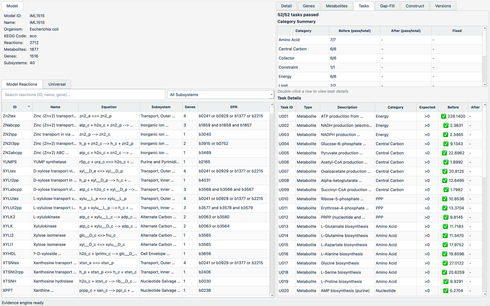

# TRACE-GEM

**Task-guided Reconstruction And Curation with Evidence for Genome-scale
Metabolic models.**

TRACE-GEM turns a protein FASTA into a draft genome-scale metabolic model
(via [CarveMe](https://carveme.readthedocs.io)), then validates and repairs it
against a curated set of metabolic tasks using COBRApy MILP gap-filling. During
gap-filling, candidate reactions from the universal model are weighted by KEGG
evidence so well-identified reactions are preferred (unevidenced ones are still
added when needed to satisfy a task). Every operation is available
through a desktop GUI (PySide6/Qt6) and a feature-equivalent command-line
interface, and can be orchestrated end-to-end from a single YAML configuration file.



*TRACE-GEM displaying the iML1515 model and its 52 metabolic-task results.*

---

## Table of contents

1. [Overview](#overview)
2. [Requirements](#requirements)
3. [Installation](#installation)
4. [Quick start](#quick-start)
5. [Tutorials](#tutorials)
6. [Input data](#input-data)
7. [Metabolic tasks and media](#metabolic-tasks-and-media)
8. [Configuration](#configuration)
9. [Important notes and caveats](#important-notes-and-caveats)
10. [Testing](#testing)
11. [Project structure](#project-structure)
12. [Related projects](#related-projects)
13. [Citing](#citing-and-acknowledgements)

---

## Overview

The platform implements a reproducible **build → gap-fill** workflow, with model
quality judged by metabolic tasks:

| Stage | What it does | Engine |
|-------|--------------|--------|
| **Build** | Reconstruct a draft model from a protein FASTA (single or batch) | CarveMe (`carve`) |
| **Gap-fill** | Find an evidence-weighted feasible reaction set that repairs failing metabolic tasks without breaking passing ones. The iterative per-task union is not a proof of a globally cardinality-minimal set. | COBRApy MILP + KEGG evidence |
| **Validate** | Model quality is judged by metabolic-task pass/fail — not by per-reaction scores. | TaskRunner |

> Evidence is **KEGG-only** and applies **only to gap-fill candidates** (to weight
> what to add). There is no standalone "evaluate the whole model" mode; use the
> metabolic tasks to judge a model.

Key properties:

- **GUI/CLI parity.** Everything available in the desktop app is available on the
  command line and vice-versa; both share the same engines and produce identical
  results.
- **Organism-aware.** A KEGG taxonomy code (e.g. `eco`, `cgb`) drives
  organism-specific gap-fill penalties and candidate KEGG evidence.
- **Task-protected gap-filling.** Previously passing tasks are protected; candidate
  reaction sets that would regress them are rejected.
- **Reproducible environments.** A single `environment.yml` (or `uv`) installs the
  app together with the CarveMe toolchain.

---

## Requirements

| Component | Requirement |
|-----------|-------------|
| Python | 3.10+ |
| OS | macOS, Linux (Windows untested) |
| Model construction | `carve` (CarveMe) + `diamond` aligner + an MILP solver |
| MILP solver | **Gurobi** (academic license, recommended) or **CPLEX**, or the free **SCIP** (slower) |
| GUI | A display, or `QT_QPA_PLATFORM=offscreen` for headless use |

> **DIAMOND is not pip-installable** (it is a compiled aligner). Install it from
> bioconda or Homebrew. CarveMe's own default solver is CPLEX, so TRACE-GEM
> always passes `--solver` explicitly (default: `gurobi`).

---

## Installation

The model-construction feature needs `carve`, `diamond`, and a solver in the same
environment as the app. The recommended path uses conda because it can install the
`diamond` binary in one step.

### Option A — conda (recommended, fully reproducible)

```bash
git clone https://github.com/jyryu3161/TRACE-GEM.git TRACE-GEM
cd TRACE-GEM

conda env create -f environment.yml     # app + CarveMe + solvers + diamond
conda activate metatask
```

`environment.yml` installs `python=3.10`, `diamond` (bioconda), and—via pip—the
package itself with the `[dev,build]` extras (CarveMe, gurobipy, pyscipopt). A
helper script wraps this and runs smoke checks:

```bash
bash scripts/setup_env.sh         # conda path
```

> The Python distribution (`metatask-gapfill`), CLI commands, Conda environment
> (`metatask`), and existing configuration directory retain their legacy names
> for backward compatibility.

### Option B — uv (fast Python install; install DIAMOND separately)

```bash
uv venv && source .venv/bin/activate
uv pip install -e ".[dev,build]"          # app + CarveMe + gurobipy + pyscipopt
conda install -c bioconda diamond         # or:  brew install diamond
# helper:  bash scripts/setup_env.sh uv
```

### Option C — gap-filling only (no model construction)

If you only need to gap-fill existing SBML models:

```bash
python -m venv .venv && source .venv/bin/activate
pip install -e ".[dev]"                   # no CarveMe/diamond/solver needed
```

### Solver licenses

- **Gurobi** — free for academics; after installing `gurobipy`, activate a license
  (`grbgetkey ...`). Verify: `python -c "import gurobipy; gurobipy.Model().optimize()"`.
- **SCIP** — free, no license (`conda install -c conda-forge pyscipopt`); select with
  `--carveme-solver scip`. Expect substantially longer build times.

### Verify the installation

```bash
metatask-gapfill-cli --check-carveme      # carve / diamond / solver availability
python -c "import cobra, PySide6; print('OK', cobra.__version__)"
```

> **Large data files** (universal model, mapping tables) are tracked with Git LFS.
> Run `git lfs install && git lfs pull` if `data/` files appear as text pointers.

---

## Quick start

```bash
conda activate metatask

# 1. Build a draft E. coli model from its proteome
metatask-gapfill-cli --build data/eco_protein.faa --organism eco --build-output eco.xml

# 2. Run the full build → refine pipeline for two organisms from one YAML
metatask-gapfill-cli --config examples/pipeline.yaml

# 3. Launch the desktop GUI
metatask-gapfill
```

---

## Tutorials

The repository ships two example proteomes — `data/eco_protein.faa`
(*Escherichia coli*, KEGG `eco`) and `data/cgb_protein.faa`
(*Corynebacterium glutamicum*, KEGG `cgb`) — plus the BiGG universal model
(`data/bigg_universal_model_fixed.json`) and a 52-task essential-task set
(`data/universal_essential_tasks.csv`).

### Tutorial 1 — Build a single model (CLI)

```bash
metatask-gapfill-cli --build data/eco_protein.faa \
    --organism eco \
    --carveme-solver gurobi \
    --build-output eco_model.xml
```

This runs `carve` as a subprocess, then loads the resulting SBML and reports the
reaction/metabolite/gene counts (≈2,600 reactions for *E. coli*). Useful flags:
`--carveme-universe {bacteria,grampos,gramneg,archaea,cyanobacteria}`,
`--carveme-universe-file PATH` (a **custom, well-curated reaction universe** in
SBML — overrides the named universe), `--carveme-gapfill-media M9,LB`,
`--gzip-model`, `--build-dna`.

### Tutorial 2 — Batch build from a manifest (CLI)

Create a manifest (`manifest.csv`); each row carries its KEGG taxonomy code:

```csv
fasta,kegg_code,universe,medium,label
data/eco_protein.faa,eco,gramneg,,E. coli
data/cgb_protein.faa,cgb,grampos,,C. glutamicum
```

```bash
metatask-gapfill-cli --batch-build manifest.csv --build-output built_models/
```

Manifest columns: `fasta` and `kegg_code` are required; `universe`,
`universe_file` (a custom SBML universe, per row), `gram`, `medium`, and `label`
are optional. Each model is built independently; a failure in one does not abort
the batch.
Refinement is **single-model only** — build the batch first, then refine models
individually.

### Tutorial 3 — Build and refine (task-aware gap-filling)

```bash
metatask-gapfill-cli --build data/eco_protein.faa --organism eco \
    --build-output eco_model.xml \
    --refine --skip-evaluation \
    --output-model eco_refined.xml \
    --output-report eco_report.csv
```

The report CSV contains a summary, the added reactions (with penalties and assigned
GPRs), and the per-task before/after pass table.

### Tutorial 4 — One-shot pipeline (YAML)

Run build → refine (gap-fill) for several organisms from one file:

```bash
metatask-gapfill-cli --config examples/pipeline.yaml                # run
metatask-gapfill-cli --config examples/pipeline.yaml --config-validate   # dry-run
```

`examples/pipeline.yaml`:

```yaml
carveme:
  solver: gurobi
  universe: bacteria
  # universe_file: path/to/custom_universe.xml.gz   # optional, overrides `universe`
build:                 # or:  models: [{path: data/iML1515.xml, kegg_code: eco}]
  mode: batch          # single | batch
  output_dir: built_models/
  jobs:
    - { fasta: data/eco_protein.faa, kegg_code: eco, universe: gramneg }
    - { fasta: data/cgb_protein.faa, kegg_code: cgb, universe: grampos }
refine:                # applied to each model, one at a time
  enabled: true
  universal: data/bigg_universal_model_fixed.json
  tasks: data/universal_essential_tasks.csv
  skip_evaluation: true
  output_model: out/{label}_refined.xml
  output_report: out/{label}_report.csv   # includes each added reaction's KEGG evidence tier
```

`{label}` / `{model}` in output paths are substituted per model; specify exactly
one of `build` or `models`.

### Tutorial 5 — Gap-fill an existing model

```bash
# Task-aware gap-filling of an existing draft (candidates weighted by KEGG evidence)
metatask-gapfill-cli data/iML1515.xml --gap-fill --organism eco \
    --universal data/bigg_universal_model_fixed.json \
    --tasks data/universal_essential_tasks.csv \
    --output-model iML1515_gapfilled.xml --output-report report.csv
```

### GUI walkthrough

```bash
metatask-gapfill        # or:  python -m src.app
```

1. **Build** — *Analysis ▸ Build Model (CarveMe)…* (`Ctrl+B`) opens the **Construct**
   tab. Choose single or batch mode, set the FASTA and KEGG code, then **Build** or
   **Build & Refine**. Configure the toolchain under *Settings ▸ Construction*.
2. **Load** a built or existing model (reaction table, overview, version history).
3. **Gap-fill** — *Analysis ▸ Task-Based Gap-Filling…* (`Ctrl+W`); inspect added
   reactions (each with its KEGG evidence tier) and before/after task results in
   the **Gap-Fill** and **Tasks** tabs.
4. **Export** — improved SBML and the gap-fill report.

The GUI runs headless for automated rendering with `QT_QPA_PLATFORM=offscreen`.

---

## Input data

| File | Description |
|------|-------------|
| `data/eco_protein.faa`, `data/cgb_protein.faa` | Example proteomes (E. coli, C. glutamicum) |
| `data/iML1515.xml`, `data/e_coli_core.xml` | Reference E. coli models |
| `data/bigg_universal_model_fixed.json` | BiGG universal reaction database (gap-fill source) |
| `data/universal_essential_tasks.csv` | 52 E. coli-oriented regression tasks |

Optional local mapping files (`reac_xref.tsv`, `bigg_models_reactions.txt`, …),
when present, improve evidence resolution and organism filtering.

---

## Metabolic tasks and media

The bundled task CSV declares an explicit shared background medium in its first
comment line; each task's `Medium` entries override it. The task runner opens
only water and protons implicitly. No trace nutrient is hidden. Tasks come in
three kinds:

- **Production tasks** (`>` operator) — a metabolite/reaction must carry flux;
  these are *gap-fillable* (reactions can be added to enable them).
- **Negative-constraint tasks** (`=0`) — a metabolite must **not** be producible
  under a deliberately restricted medium (e.g. *"no ATP without a carbon source"*);
  these are **not** gap-fillable and are protected, not modified.
- **Upper-bound tasks** (`<`) — also not gap-fillable.

The bundled regression is verified against iML1515 (52/52, all solver statuses
optimal). It is not a cross-species quality benchmark. For any non-E. coli model,
the CLI and GUI require an explicitly selected organism-specific task file.
Core/partial models may fail production tasks whose pathways they lack; refinement
attempts to repair only gap-fillable lower-bound production failures.

> **Why the model's default medium is *not* merged.** When `--medium` is omitted,
> TRACE-GEM uses each task's own medium and does **not** merge the draft
> model's default medium. Merging it would add nutrients (e.g. glucose) back into
> negative-constraint tasks that omit them on purpose, silently breaking those
> tests. Supply `--medium` only when you intend an explicit shared base medium; it
> is then applied identically in the CLI and GUI.

---

## Configuration

Persistent settings live in `~/.metataskgapfill/config.json` (edit via the GUI
*Settings* dialog or directly). Selected keys:

| Key | Default | Description |
|-----|---------|-------------|
| `kegg_organism_code` | `eco` | KEGG organism code |
| `candidate_evidence_max_error_fraction` | `0.0` | Maximum tolerated API-error fraction in evidence-weighted runs |
| `default_universal_model` | `data/bigg_universal_model_fixed.json` | Gap-fill universal |
| `default_task_file` | `data/universal_essential_tasks.csv` | E. coli-only default task set |
| `gapfill_iterations` / `gapfill_alternatives` | `5` / `5` | Gap-fill convergence / per-task alternatives |
| `carveme_solver` | `gurobi` | MILP solver for CarveMe (`gurobi`/`cplex`/`scip`) |
| `carveme_universe` | `""` | CarveMe universe template |
| `carveme_env` | `""` | Conda env holding `carve` (runs via `conda run`) |
| `carveme_timeout` | `1800` | Per-model build timeout (s) |
| `carveme_max_parallel` | `1` | Batch build parallelism |

CLI flags (`--carveme-solver`, `--organism`, `--medium`, …) override config for a
single invocation.

---

## Important notes and caveats

- **CarveMe runs as an external subprocess.** It is never imported, keeping its
  `reframed`/`python-libsbml` dependencies isolated from the app's `cobra`/`PySide6`
  stack. If a same-environment install ever conflicts, install CarveMe in a separate
  conda env and point `carveme_env` at it.
- **DIAMOND is required and not pip-installable** — install via bioconda or Homebrew.
- **Solver licensing.** Gurobi/CPLEX need a license; SCIP is free but slow (minutes
  per model). The build always passes `--solver` explicitly because carve defaults to
  CPLEX.
- **Reserved reaction IDs.** Some CarveMe models contain reaction IDs that collide
  with LP/MPS keywords (e.g. `St`); these are automatically renamed on load
  (`St → St_rxn`) to keep solver model-copy/snapshot operations safe.
- **Negative-constraint tasks are organism-specific.** The bundled task set is
  E. coli-oriented and must not be reused as a quality benchmark for another
  organism. Supply a curated organism-specific file with `--tasks`.
- **Performance.** Building a ~4,600-protein proteome takes a few minutes with
  Gurobi (much longer with SCIP). Large universal models are pruned for tractable
  MILP solving.
- **Batch vs. refinement.** Models can be built in batch, but task-aware
  refinement is performed one model at a time by design.

---

## Testing

```bash
pytest -m "not integration"          # fast unit suite (mocked external tools)
pytest -m integration                # real carve builds on the bundled proteomes
pytest --cov=src --cov-report=term-missing

ruff check src tests scripts                         # lint
ruff format --check src tests scripts                # formatting
mypy src scripts/validate_evidence_tiers.py --ignore-missing-imports
```

Integration tests are skipped automatically if `carve` is not installed. GUI tests
run under `QT_QPA_PLATFORM=offscreen`.

---

## Reproducibility and validation

Gap-fill runs that write a model or report also write:

- `*.manifest.json` with input/output SHA-256 hashes, package and solver versions,
  git state, complete scientific configuration, mapping-file hashes, task summary,
  and the exact penalty policy.
- `*.evidence.json.gz` with every candidate evidence record actually used by the
  optimizer, including KEGG reconciliation and stoichiometry provenance.

Successful CarveMe builds write `*.build.manifest.json` with FASTA/universe/output
hashes, the exact subprocess argv, options, duration, and probed CarveMe, DIAMOND,
and solver versions. `uv.lock` pins the application/development environment.

GUI project format 2.0 embeds the current modified SBML snapshot as gzip+base64
with SHA-256 validation; loading no longer depends on the original SBML path.

Synthetic evidence decoys are diagnostics only. Publication claims require an
independently curated benchmark:

```bash
python scripts/validate_evidence_tiers.py \
  --benchmark independent_labels.csv --require-independent --json validation.json
```

See [`docs/validation-protocol.md`](docs/validation-protocol.md) for label
independence, baseline/ablation, uncertainty, gap-fill holdout, MEMOTE, phenotype,
and gene-essentiality requirements.

---

## Project structure

```text
src/
├── build/             # Model construction (CarveMe)
│   ├── carveme_runner.py   # `carve` subprocess wrapper (stream / cancel / timeout)
│   ├── build_manifest.py   # batch manifest parsing + validation
│   └── build_engine.py     # build → load → (refine) orchestration
├── core/              # Domain models, SBML/COBRA utilities, task runner
├── evidence/          # KEGG-only candidate evidence engine + rule-based tier scoring
├── gapfill/           # Task-aware gap-filling
│   ├── engine.py           # MILP gap-fill workflow (task-protected)
│   └── refine.py           # reusable refinement core
├── gui/               # PySide6 desktop UI (panels, controllers, workers)
├── utils/             # Config, constants, logging
├── pipeline.py        # YAML pipeline runner (build → refine/gap-fill)
├── app.py             # GUI entry point
└── cli.py             # CLI entry point (gap-fill / build / pipeline)
```

---

## Related projects

TRACE-GEM is part of a complementary genome-scale metabolic modeling toolchain:

- [**CMM — Cellular Metabolic Modeling Platform**](https://github.com/jyryu3161/CMM): constraint-based single-model analysis, omics integration, perturbation, strain-design, and visualization workflows.
- [**CMIG — Community Metabolic Interaction GUI**](https://github.com/jyryu3161/CMIG): desktop and command-line workflows for microbial-community and host–microbe metabolic interaction analysis.
- [**troppo — modified fork**](https://github.com/jyryu3161/troppo): this project's maintained fork of the [BioSystemsUM/troppo](https://github.com/BioSystemsUM/troppo) reconstruction-algorithms library for Python.

---

## Citing and acknowledgements

If you use TRACE-GEM in academic work, please cite this repository and the
underlying tools:

- **CarveMe** — Machado et al., *Nucleic Acids Research* (2018), "Fast automated
  reconstruction of genome-scale metabolic models for microbial species and
  communities."
- **COBRApy** — Ebrahim et al., *BMC Systems Biology* (2013).
- **DIAMOND** — Buchfink et al., *Nature Methods* (2015, 2021).
- Reaction evidence: **KEGG** (Kanehisa et al.). **BiGG Models** supplies the
  universal pool and identifier mappings, not an evidence score.

## License

MIT
